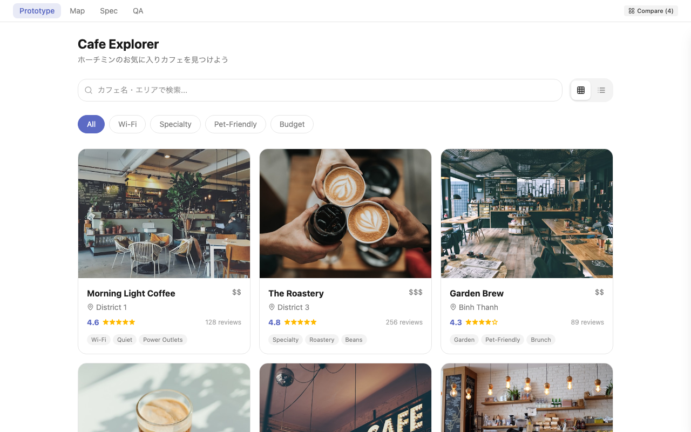
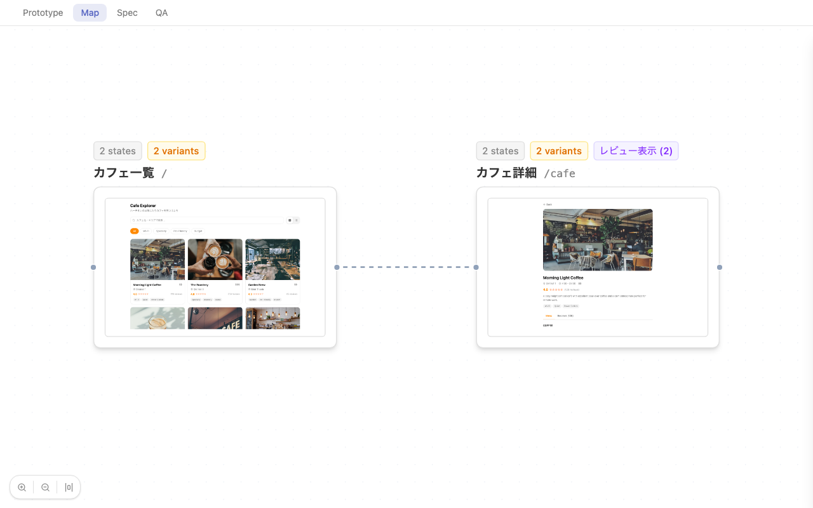
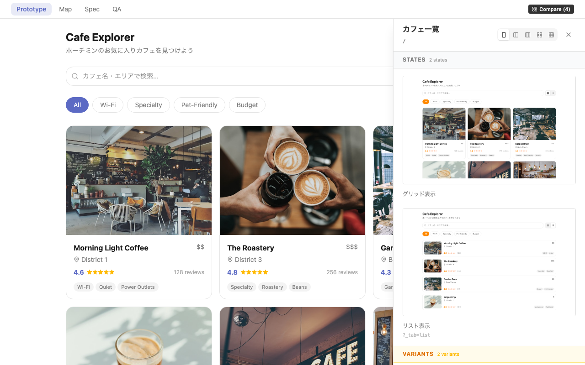
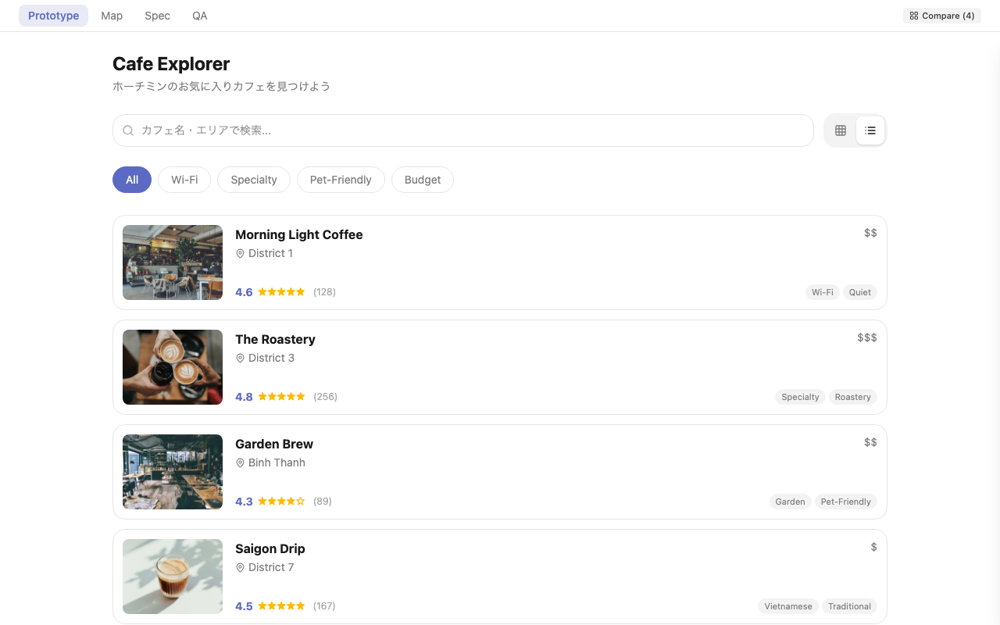
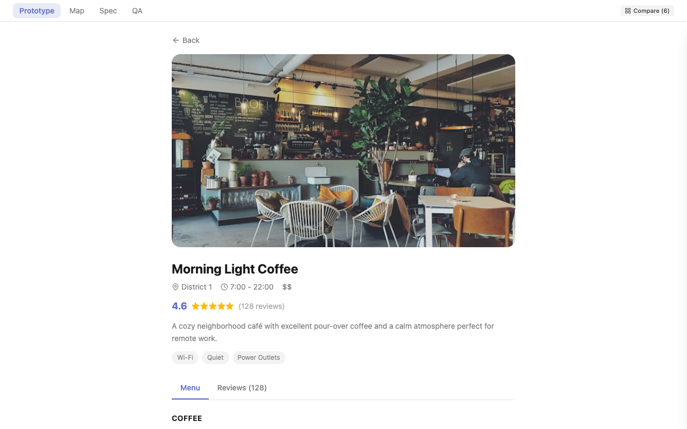

# Design with Claude Code

Claude Code を使った UI プロトタイピングのテンプレートとスキル集。



> **Blog**: [開発スピードを上げたくてClaude Code中心のデザイン環境を組んでみた](https://x.com/sota_mikami/status/2031351426241409115)
> — このテンプレートが生まれた背景と実際のワークフローを紹介しています。

## 誰のためのテンプレート？

**Claude Code でプロトタイプを作りたいデザイナー・PdM 向け**です。

- コードが書けなくても OK — Claude Code が全部書いてくれます
- 「ボタンを赤くして」「余白を広げて」のような自然言語でデザインを進められます
- Figma → 実装の間の「翻訳コスト」をなくし、実コードでプロトタイプを作れます

### こんな人におすすめ

- デザイン案を素早くURLで共有して、チームからフィードバックをもらいたい
- 複数パターンを作って横並び比較したい
- プロトタイプから実装仕様書・QAチェックリストまでワンストップで仕上げたい

## 前提条件

| ツール | バージョン | インストール |
|--------|-----------|-------------|
| Node.js | 20 以上 | [nodejs.org](https://nodejs.org/) |
| Claude Code | 最新 | `npm install -g @anthropic-ai/claude-code` |
| Git | - | macOS: Xcode CLT に同梱 / Windows: [git-scm.com](https://git-scm.com/) |

> **Tip**: `node -v` と `claude --version` で確認できます。

## Quick Start

```bash
# 1. リポジトリをクローン
git clone https://github.com/Sota-Mikami/design-with-claude-code.git
cd design-with-claude-code/

# 2. スキルを導入（Claude Code にワークフローを教える）
mkdir -p ~/.claude/skills
cp -r skills ~/.claude/skills/vibe-design

# 3. テンプレートをコピーして開発開始
cp -r template/ ../my-prototype/
cd ../my-prototype/
npm install

# 4. 開発サーバー起動
npm run dev
# -> http://localhost:3000

# 5. 別のターミナルを開いて、同じディレクトリで Claude Code を起動
cd ../my-prototype/
claude
# 会話例:
#   「ユーザー一覧画面のプロトタイプを作って」
#   「タブを追加して、フィルター機能をつけて」
#   「パターンBとしてカード表示バージョンも作って」
```

## できること

- **会話でUIプロトタイプを作成** — ワイヤーフレームからリッチプロトタイプまで
- **複数パターンを一括生成** — Compare パネルで横並び比較
- **画面遷移マップの自動生成** — React Flow でビジュアライズ
- **スクリーンショットの自動撮影** — Playwright で全画面一括キャプチャ
- **実装指示書・QAチェックリストの生成** — プロトタイプからそのまま
- **GitHub Pages でデプロイ & URL共有** — push するだけ

## ワークフロー

```
1. ワイヤーフレーム（グレースケールで構造を固める）
       ↓
2. リッチプロトタイプ（ブランドカラー適用）
       ↓
3. 画面マップ（screens.ts に定義 → /map で確認）
       ↓
4. スクリーンショット（npm run capture-screens）
       ↓
5. デプロイ & URL共有（GitHub Pages）
       ↓
6. 実装指示書（/spec）・QAチェックリスト（/qa）
```

### 画面マップ（/map）

`screens.ts` に画面を定義すると、React Flow で画面遷移図が自動生成されます。
ノードをクリックすると、その画面の States / Variants / Patterns を一覧表示。



### ワイヤーフレーム → リッチプロトタイプ

テンプレートにはグレースケール専用トークン（`--wf-*`）が用意されています。
まず色をつけない状態で情報設計・レイアウトを固め、承認後にブランドカラーに差し替えます。

```
--wf-accent  →  --color-primary
--wf-bg      →  --color-bg
--wf-surface →  --color-bg-surface
--wf-text    →  --color-text
```

### State / Variant / Pattern の使い分け

| 概念 | 誰が切り替える？ | 本番に残る？ | クエリパラム | 例 |
|------|-----------------|------------|-------------|-----|
| **State** | ユーザー（アプリ内UI操作） | 全て残る | `_tab=xxx` | タブ切替、グリッド/リスト |
| **Variant** | システム（データ条件） | 全て残る | `_v=xxx` | 空状態 / ローディング / エラー |
| **Pattern** | デザイナー（設計方針の比較） | 1つだけ採用 | `_p=xxx` | カード型 vs タイムライン型 |

**判断基準**: アプリ内にトグルUI（ボタン・タブ等）があれば **State**。なければ **Pattern**。

### Compare パネル

ProtoNav の **「Compare (N)」ボタン** でドロワーが開き、States / Variants / Patterns を横並び比較できます。
ページ遷移に自動追従するので、画面を切り替えても比較対象が更新されます。



## テンプレートに含まれるサンプル

テンプレートには **Cafe Explorer** というサンプルアプリが入っています。
States / Variants / Patterns の実装パターンを具体的なコードで確認できます。
新規プロトタイプでは中身を差し替えて使ってください。

- カフェ一覧（グリッド/リスト表示、検索、フィルタ）
- カフェ詳細（メニュー/レビュータブ、カード型 vs タイムライン型レビュー）
- 各画面のローディング・空状態バリアント
- 10枚のサンプルスクリーンショット

| 一覧（グリッド） | 一覧（リスト） | 詳細 |
|:---:|:---:|:---:|
|  |  |  |

## ディレクトリ構成

```
.
├── template/          # プロトタイプテンプレート（コピーして使う）
│   ├── DESIGN.md              # デザインシステム定義（Claude Code が最初に読む）
│   ├── src/app/
│   │   ├── globals.css       # デザイントークン（Indigo系サンプル）
│   │   ├── data.ts           # サンプルデータ（カフェ情報）
│   │   ├── page.tsx          # カフェ一覧（グリッド/リスト切替）
│   │   ├── cafe/page.tsx     # カフェ詳細（メニュー/レビュー）
│   │   ├── proto-nav.tsx     # ナビバー + Compare ボタン
│   │   ├── base-path.ts      # GitHub Pages basePath ユーティリティ
│   │   ├── map/              # 画面マップ（React Flow）
│   │   ├── spec/             # 実装指示書（サンプル記入済み）
│   │   └── qa/               # QAチェックリスト（サンプル記入済み）
│   ├── scripts/              # スクリーンショット自動撮影
│   ├── public/screenshots/   # サンプルスクリーンショット（10枚）
│   ├── .github/workflows/    # GitHub Pages 自動デプロイ
│   ├── Dockerfile            # Docker デプロイ用（参考）
│   └── nginx.conf
├── skills/            # Claude Code スキルファイル
│   ├── SKILL.md              # メインワークフロー
│   ├── SCREEN_MAP_GUIDE.md   # 画面マップの使い方
│   └── SPEC_GUIDE.md         # 仕様書・QAの書き方
└── README.md
```

## 技術スタック

| 技術 | 用途 |
|------|------|
| Next.js 15 | フレームワーク（Static Export） |
| Tailwind CSS v4 | スタイリング |
| React Flow 12 | 画面マップ |
| Playwright | スクリーンショット自動撮影 |
| lucide-react | アイコン |

## デプロイ & URL共有

プロトタイプを URL で共有するまでの手順です。
テンプレートに GitHub Actions ワークフローが同梱されているので、**push するだけで自動デプロイ**されます。

> **Tip**: Claude Code に「このプロトタイプをデプロイして」と頼めば、以下の手順を代わりにやってくれます。

### 前提: GitHub CLI

デプロイ手順では [GitHub CLI (`gh`)](https://cli.github.com/) を使います。

```bash
# インストール確認
gh --version

# 未インストールの場合
brew install gh        # macOS
# インストール後、ログイン
gh auth login
```

### Step 1: GitHub リポジトリを作成

```bash
gh repo create your-org/proto-feature-name --private --source=. --push
```

このコマンドで以下が一度に実行されます:
- GitHub 上に Private リポジトリを作成
- ローカルの git を初期化（未初期化の場合）
- コードを push

> **手動で行う場合**: [github.com/new](https://github.com/new) からリポを作成し、表示される手順に従って push してください。

### Step 2: GitHub Pages を有効化

1. GitHub のリポジトリページを開く（`gh browse` で開けます）
2. **Settings** > **Pages** に移動
3. **Source** を **"GitHub Actions"** に変更して保存

### Step 3: 再度 push してデプロイ

```bash
# Pages 有効化後、ワークフローを再実行
git commit --allow-empty -m "Trigger deploy"
git push
```

push すると GitHub Actions が自動でビルド & デプロイします。
1〜2分後に以下の URL でアクセスできます:

```
https://your-org.github.io/proto-feature-name/
```

> **確認方法**: リポの **Actions** タブで、ワークフローが緑（成功）になっていれば OK です。

### アクセス制御に関する注意

GitHub Pages のサイトは**リポが Private でも URL を知っていれば誰でもアクセスできます**（GitHub Team プランの場合）。
プロトタイプレベルなら問題ないことが多いですが、公開前の施策など機密性の高い内容を扱う場合は注意してください。

| GitHub プラン | リポは Private | サイトのアクセス |
|--------------|:---:|------|
| **Enterprise Cloud** | OK | リポの read 権限を持つ人のみ閲覧可能（推奨） |
| **Team** | OK | **URL を知っていれば誰でもアクセス可能** |
| **Public リポ** | - | **完全に公開**（検索エンジンにもインデックスされる） |

> **対策の例**:
> - 機密性の高いプロトタイプは **Private リポ + Enterprise Cloud** を使う
> - Team プランの場合、簡易パスワード認証（Basic Auth）を自前で追加する
> - URL を推測しにくい名前にする（`proto-abc123` など）

### 更新するとき

コードを変更して push するだけで自動再デプロイされます。

```bash
git add -A && git commit -m "Update: 変更内容"
git push
```

### 参考: Docker

テンプレートには Dockerfile + nginx.conf も含まれています。
自前サーバー + Coolify や Fly.io 等でホスティングする場合はこちらを使ってください。

## デザイントークンのカスタマイズ

`template/src/app/globals.css` の CSS 変数を自社のデザインシステムに合わせて書き換えてください。

```css
@theme {
  --color-primary: #YOUR_BRAND_COLOR;
  --color-primary-hover: #YOUR_HOVER_COLOR;
  /* ... */
}
```

テンプレートのサンプルは Indigo 系（`#5C6AC4`）を使用しています。

## 自分のチーム用にカスタマイズする

テンプレートをそのまま使うこともできますが、チームに合わせてカスタマイズするとより効果的です。
以下のファイルを上から順に調整していくのがおすすめです。

### 1. DESIGN.md — デザインの「ルールブック」

Claude Code が最初に読むファイルです。ここに書いた制約に従ってプロトタイプが生成されます。

```markdown
# こんなことを書く
- ブランドカラー（Primary / Secondary / Accent）
- 禁止事項（グラデーション禁止、特定フォント以外禁止 etc.）
- コンポーネントのルール（ボタンは角丸8px、カードには影をつけない etc.）
- トーン&マナー（「やわらかい印象」「業務ツールらしく硬め」etc.）
```

> **Tip**: Claude Code に「DESIGN.md にうちのデザインシステムのルールをまとめて」と頼むと、対話しながら作ってくれます。

### 2. globals.css — カラー・スペーシング・フォント

`@theme` ブロックの CSS 変数を書き換えます。

| 変数 | 用途 | カスタマイズ例 |
|------|------|-------------|
| `--color-primary` | ブランドカラー | 自社のプライマリカラー |
| `--color-bg` / `--color-bg-surface` | 背景色 | ダーク系にすればダークモード風 |
| `--font-sans` | フォント | `"Noto Sans JP"` 等を追加 |
| `--spacing-*` | 余白の単位 | 4px刻みを6px刻みに変更 etc. |
| `--radius-*` | 角丸 | 全体的に丸くする / シャープにする |

### 3. SKILL.md — ワークフローのカスタマイズ

スキルファイルを編集すると、Claude Code の動き方を変えられます。

```markdown
# カスタマイズ例

## AI Constraints に追加
- shadcn/ui のコンポーネントを優先的に使う
- 画像はすべて placeholder.svg を使う
- 日本語テキストにはダミーではなく実際のコピーを使う

## ワークフローにステップを追加
### Step 7: デザインレビュー
スクリーンショットを見て、UX の改善点を 3 つ提案する
```

### 4. data.ts / page.tsx — サンプルコンテンツの差し替え

テンプレートの Cafe Explorer はあくまでサンプルです。自分のプロジェクトでは中身を丸ごと差し替えてください。Claude Code に「このカフェアプリを TODO アプリに作り変えて」のように頼めば OK です。

### 5. proto-nav.tsx — ナビゲーションの構成

ナビバーのリンクを変更できます。不要なページ（Spec / QA 等）を外したり、独自のページを追加できます。

---

## すぐに試せる拡張

テンプレートの基本機能に加えて、Claude Code に「〜を追加して」と頼むだけで導入できます。

| 拡張 | やり方 |
|------|--------|
| **shadcn/ui 導入** | `npx shadcn@latest init` — ボタン、ダイアログ、フォーム等の本格コンポーネント |
| **Figma 連携** | Figma MCP を使えば、既存の Figma デザインをコードに変換 |
| **アニメーション** | Framer Motion を追加して、ページ遷移やマイクロインタラクション |
| **ブランチ戦略** | 1 リポ × 複数ブランチで、チーム全員のプロトタイプを集約管理 |
| **スキルの共有** | チーム共通の `SKILL.md` を Git 管理し、全員が同じワークフローで作業 |

---

## 今後の展望

このテンプレートはまだ進化の途中です。
以下は今後実現できそうなアイデアのリストです。開発者が実装するかもしれないし、あなたが Claude Code に頼んで先に作ってしまっても OK です。

### コラボレーション

- **プロトタイプ上のコメント機能** — [Liveblocks](https://liveblocks.io/) + [Supabase](https://supabase.com/) で、画面の任意の場所にピン留めコメント。スレッド形式のリプライ、メールベースのアクセス制御
- **Slack 連携** — デプロイ完了時に Slack チャンネルへ URL を自動投稿。フィードバックもスレッドで集約
- **フィードバックフォーム埋め込み** — プロトタイプ内にフォームを設置し、Notion や Google Sheets にレスポンスを自動記録

### 品質・自動化

- **QA チェックの自動化** — Playwright でユーザーフロー（ボタンクリック → 画面遷移 → 表示確認）を自動テスト。手動 QA の前に主要パスを検証
- **アクセシビリティ自動チェック** — axe-core 等でプロトタイプ段階から WCAG 準拠を検証
- **レスポンシブ自動キャプチャ** — モバイル / タブレット / デスクトップの 3 サイズでスクショを一括撮影・比較
- **デザインレビュー AI** — スクリーンショットを Claude に見せて UX の改善提案を自動生成

### デザインシステム連携

- **Figma トークン同期** — Figma の Variables / Design Tokens を `globals.css` に自動反映
- **Storybook 自動生成** — プロトタイプのコンポーネントから Storybook を自動生成し、開発チームに共有
- **ダークモード** — `globals.css` にダーク用トークンを追加し、`prefers-color-scheme` で切り替え

### ワークフロー拡張

- **A/B テスト** — 複数パターンを個別 URL でデプロイし、実ユーザーでどちらが良いかテスト
- **パスワード保護** — 機密性の高いプロトタイプに簡易認証を追加
- **実データ接続** — Supabase や REST API と繋いで、ダミーではなく実際のデータでプロトタイプを動かす

> アイデアや要望があれば [Issue](https://github.com/Sota-Mikami/design-with-claude-code/issues) でお気軽にどうぞ。

---

## スキルの仕組み

Claude Code の「スキル」は、特定のワークフローを Markdown で定義したものです。
`~/.claude/skills/` に配置すると、会話の中で自動的にそのワークフローに従って動きます。

### トリガーワード

以下の言葉を会話で使うとスキルが自動発動します:

> デザイン / プロトタイプ / モックアップ / UI設計 / ワイヤーフレーム / 実装指示書 / 仕様書 / QA / テストケース

### スキルファイル

| ファイル | 役割 |
|----------|------|
| `SKILL.md` | メインワークフロー（ワイヤーフレーム → デプロイまで） |
| `SCREEN_MAP_GUIDE.md` | 画面マップの使い方 |
| `SPEC_GUIDE.md` | 実装指示書 & QA の書き方 |

## FAQ

### Q: コードが書けなくても使える？
はい。Claude Code が全部書いてくれます。「ボタンを赤くして」「余白を広げて」のような自然言語の指示で十分です。出力されたコードの基本的な構造を理解しておくと、より的確な指示が出せるようになります。

### Q: Figma と併用できる？
できます。Figma MCP を使えば、Figma のデザインを読み込んでコードに変換できます。

### Q: デザイントークンは自社のものに差し替えられる？
はい。`globals.css` の CSS 変数を書き換えるだけです。

### Q: チーム全体で使うには？
テンプレートをクローンして、スキルファイル（`skills/`）をチームで共有してください。`globals.css` にチームのデザイントークンを設定すれば、全員が同じ基盤で作業できます。

## License

MIT
